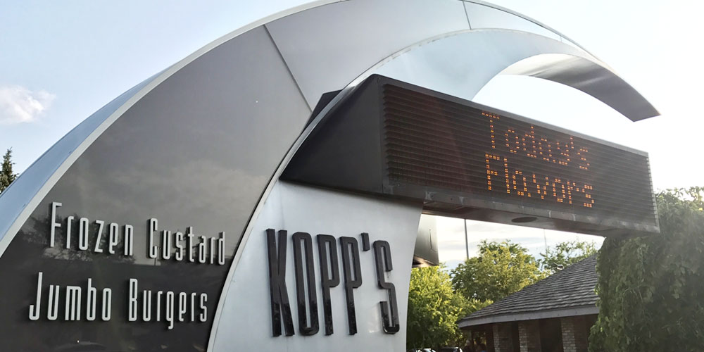
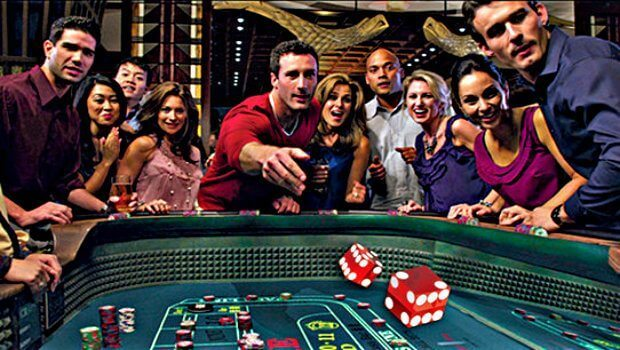
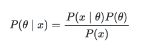
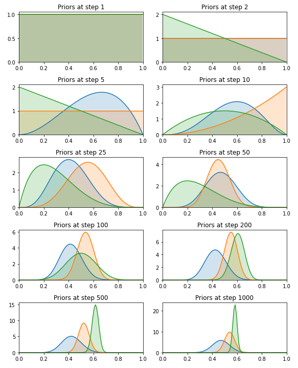
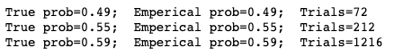

# Multi Armed Bandits
### Arhum Zafar / December 2020

The multi armed bandit problem can be used to display the exploration vs exploitation paradox. This introduces the bandit problem and how one can solve it using different methods. 


## Table of Contents
1. [Exploration vs Exploitation](#exploration)
2. [Multi-Armed Bandits](#multiarmedbandit)
3. [Defining the Bandit experiment](#define)
4. [Bayesian Significance and the Bernoulli Distribution](#bb)
5. [Maximizing Reward and Minimizing Regret](#max)
6. [Going Further](#last)
<br>

## What is Exploration and Exploitation? <a name="exploration"></a>
We see the battle between exploration and exploitation in almost every day of our lives. For example, let's say that your favorite ice cream shop is down the 
block. If you go there often, you'll always be sure of what to get, but you'll miss the possibility of discovering a better place to have ice cream. On the other
hand, if you try new places all the time, you will very likely find yourself eating unpleasant ice cream every now and then (*Come on now, don't tell me you have the ability to choose the best item on the menu, even when it's your first time*).
<br>
<br>

<br>
<br> 

The given scenario is a prime example of what we call the 
**exploration-exploitation trade-off** : a well-known problem that occurs in scenarios where a learning system (or a human) has to repeatedly make a choice with uncertain pay-offs (like bad ice cream 😉 ). Furthermore, the main dilemma for a decision making system that only has incomplete knowledge of an environment is whether to repeat decisions that have worked well so far (**Exploit**), or to make new decisions in an attempt to reap better rewards (**Explore**).
<br>
<br>

## What are Multi-Armed Bandits? <a name="multiarmedbandit"></a>
Problems surrounding multi-armed bandits are problems that thoroughly demonstrate the exploration vs exploitation tradeoff. Another example, lets say that you're sitting in a casino, in front of several slot machines. Each machine has an unknown probability of the chances that you win the reward at one play -- talk about a high roller scenario. My question for you is: 
*What is the best method that you could take to win the largest rewards?*
<br>
<br>

<br>
<br>
One possible approach is to commit to one machine and play it over and over again, to the point where
you would reach a point where you would estimate the "true" win probability; this is proven by the [Law of Large Numbers](https://en.wikipedia.org/wiki/Law_of_large_numbers). Despite how fun this method may be, it's quite wasteful and grants no guarantee towards the best long-term reward.
<br>
In a [multi-armed bandit](https://en.wikipedia.org/wiki/Multi-armed_bandit) (MAB) problem, we try to maximize the gain over time by gambling on bandits (*slot machines*) have have different expected outcomes. The concept itself is similar to [A/B Testing](https://en.wikipedia.org/wiki/A/B_testing), something that many of you have experienced as a result of marketing emails, newsletter sign-ups, and more. 
<br>
<br>

## Defining the Bandit <a name="define"></a>

In the example below, we'll simulate 3 bandits, each with an underlying probability of winning stored in the variable `prob_bandits`. Below, the `choose(i)` nethod will choose bandit **i** and randomly decide if it is a win (1), or not (0), based on probability.

```python
import scipy 
from scipy import stats
import matplotlib.pyplot as plt
import numpy as np

# Define the multi-armed bandits
nb_bandits = 3  # Number of bandits
# True probability of winning for each bandit
prob_bandits = [0.45, 0.55, 0.60]


def choose(i):
    """Pull arm of bandit with index `i` and return 1 if win, 
    else return 0."""
    if np.random.rand() < prob_bandits[i]:
        return 1
    else:
        return 0
``` 
<br>
<br>

## Bayesian Significance and the Bernoulli Distribution <a name="bb"></a>
Choosing a specific bandit will result in a win of a certain probability -- the higher the probability, the more likely choosing the arm of the bandit will result in a win. However, we don't know this probability, so we will have to model it against our observations of a certain bandit winning or losing. We will model this probability as **θ**. Thus, based off of observing an outcome, x, we can now model this distribution as **P( θ | x )**. Using [Bayes rule](https://en.wikipedia.org/wiki/Bayes%27_theorem), we can now write the relationship as: <br>

 

 P( θ | x ) is what we call the posterior distribution of θ after obsvering x. Going forward, we'll be able to find this via the likelihood P( x | θ ) and the prior P( θ ). For this exact case, the likelihood function P( x | θ ) follows what we call the [Bernoulli distribution](https://en.wikipedia.org/wiki/Bernoulli_distribution). 

<br>
<br>

## Maximizing Reward & Minimizing Regret  <a name="max"></a>
Once again, the goal of the MAB problem is the maximize reward and minimize regret. However, there is somewhat of a exploitation-exploration tradeoff we have to make here. You see, the more we choose the best bandit (option), the more certain we become of the probability of that bandit. But there are other bandits (options) that we haven't chosen yet that now have a lower expected probabilty but with a higher uncertainty -- *because we have yet to choose it to find out what results it can bring*. This is where we see the chance that the unchosen bandits are actually better in success than our percieved "best bandit".
<br>
<br>
To address this, we use somehting called [Thompson Sampling](https://en.wikipedia.org/wiki/Thompson_sampling). Using this we will, for each bandit, sample the probability 
θ from the prior and pull the bandit with the highest sampled probability. And repeat this step until finished. 
<br>
<br>
This is all demonstrated below, the run is simulated for 1500 steps -- results are plotted below.

```python
fig, axs = plt.subplots(5, 2, figsize=(8, 10))
axs = axs.flat

# The number of trials and wins will represent the prior for each
#  bandit with the help of the Beta distribution.

# Let's keep track of how many trials and wins per bandit.
trials = [0, 0, 0]  # Number of times we tried each bandit
wins = [0, 0, 0]  # Number of wins for each bandit

n = 1500
# Run the trail for `n` steps
for step in range(1, n+1):
    # Define the prior based on current observations
    bandit_priors = [
        stats.beta(a=1+w, b=1+t-w) for t, w in zip(trials, wins)]
    # plot prior 
    if step in plots:
        plot(bandit_priors, step, next(axs))
    # Sample a probability theta for each bandit
    theta_samples = [
        d.rvs(1) for d in bandit_priors
    ]
    # choose a bandit
    chosen_bandit = np.argmax(theta_samples)
    # Pull the bandit
    x = choose(chosen_bandit)
    # Update trials and wins (defines the posterior)
    trials[chosen_bandit] += 1
    wins[chosen_bandit] += x

plt.tight_layout()
plt.show()
``` 
<br>



```python
# Let's plot the final outcome and number of tests needed per bandit.
p_bandits = [(1+w) / (1+t) for t, w in zip(trials, wins)]
for i in range(nb_bandits):
    print((f'True prob={p_bandits[i]:.2f};  '
           f'Emperical prob={p_bandits[i]:.2f};  '
           f'Trials={trials[i]:d}'))
``` 


When looking at the above results, the model has shown the ability to quickly converge to the bandit with the greatest probability of winning. After 1500 iterations, it chooses the winning bandit over 5 times as much as the others. 
<br>
<br>

## Going Further <a name="last"></a>

For more information on MAB:
- http://varianceexplained.org/statistics/beta_distribution_and_baseball/
- https://www.evanmiller.org/bayesian-ab-testing.html


<br>
<br>
thanks