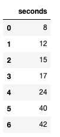
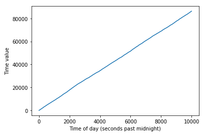
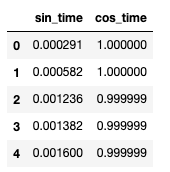
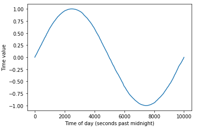
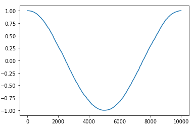
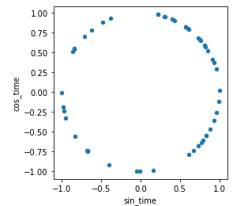

## Arhum Zafar - November 2020

<br>

It's obvious that time is naturally cyclical. There are several examples of data that are cyclical in nature, such as: a planet's position in orbit, spatial features like longitude or rotation, and visual features like a color wheel.  
<br>
As humans, it's easy to grasp this concept when something operates in cycles -- but how would a machine learning model know this? Especially when building a model that is to scale (production ready), we should expect our models to be able to tell when a feature is cyclical, and when it's not. 
<br>
<br>
As silly as it sounds, the best way to understand time is to work with it; and that's what we'll try to do here. Let's create a fake 24 hour time dataset. This dataset could correspond to so many things like the climate, number of people entering a store, literally anything. We just want to ensure that our model understands that the data is cyclical.
<br>
<br>
```python
%matplotlib inline
import matplotlib.pyplot as plt
import numpy as np
import pandas as pd
``` 

```python
def time_generator(n):
    """This function will generate n-rows of random 24-hour times (in seconds past midnight)"""
    rand_seconds = np.random.randint(0, 24*60*60, n)
    return pd.DataFrame(data=dict(seconds=rand_seconds))


n_rows = 10000
df = time_generator(n_rows)
# sort data
df = df.sort_values('seconds').reset_index(drop=True)
df.head(7)
``` 
<br>
The resulting dataframe would look something like this:<br>
<br>

 <br>
<bR>
Now, let's plot our data to visualize it better.
```python
fig = plt.figure
plt.plot(df.seconds)
plt.xlabel("Time of day (seconds past midnight)")
plt.ylabel("Time value")
```




By looking at the graph formed above, we can tell that there is a "split" that conveys no closeness between data when midnight is reached (*look at the y value when x=0 (midnight), and compare it to x is at its largest value (when it's roughly 11:59pm)*. This "split" is a very large difference that can be a point of concern for a machine learning model. 
  
<br>
Ideally, we want our model to understand that 23:55pm and 00:05am are only 10 minutes apart; for now, those times are currently being seen as being 23 hours and 50 minutes apart.
<br>
<br>

## Using 2 dimensions to transform data

In order to solve this problem, we'll create two new features by using a sine & cosine transform of the seconds-past-midnight feature.

```python
seconds_in_day = 24*60*60

df['sin_time'] = np.sin(2*np.pi*df.seconds/seconds_in_day)
df['cos_time'] = np.cos(2*np.pi*df.seconds/seconds_in_day)

df.drop('seconds', axis=1, inplace=True)

df.head()
```
Let's print out the first couple rows of our new dataframe.



```python
fig = plt.figure
plt.plot(df.sin_time)
plt.xlabel("Time of day (seconds past midnight)")
plt.ylabel("Time value")
```



By looking at the above plot, we can now notice that 5 minutes before midnight (11:55pm) and 5 minutes after midnight (00:05am) are only 10 minutes apart. This helps us solve our first problem, but we're not done just yet. By using the sine transformation, you get a weird occurrence. If you were draw a horizontal line at any point in the graph, you would notice that it touches two points. From this, it appears that midnight == noon, 2:15am == 11:45am, and so on -- which is obviously incorrect. In order to fix this, we use a cosine transformation as well.

```python
fig = plt.figure
plt.plot(df.cos_time)
```


When this feature is now added to the plot, the symmetry that we had seen before has been broken. If we combine both features, all times can be identified seperately!
<br>
<br>
Another way we could show what we did is to plot the two features we just created in two dimensions as a 24-hour clock. Below, the distance between any two points would correspond to the difference in time that we could expect from a cyclic, 24 hour time cycle. 

<br>

```python
df.sample(50).plot.scatter('sin_time','cos_time').set_aspect('equal');
```
<br>



<br>
<br>
<br>

### Additional Reading:
To check out some additional information on this matter, check out:

- https://stats.stackexchange.com/questions/126230/optimal-construction-of-day-feature-in-neural-networks
- https://datascience.stackexchange.com/questions/5990/what-is-a-good-way-to-transform-cyclic-ordinal-attributes


